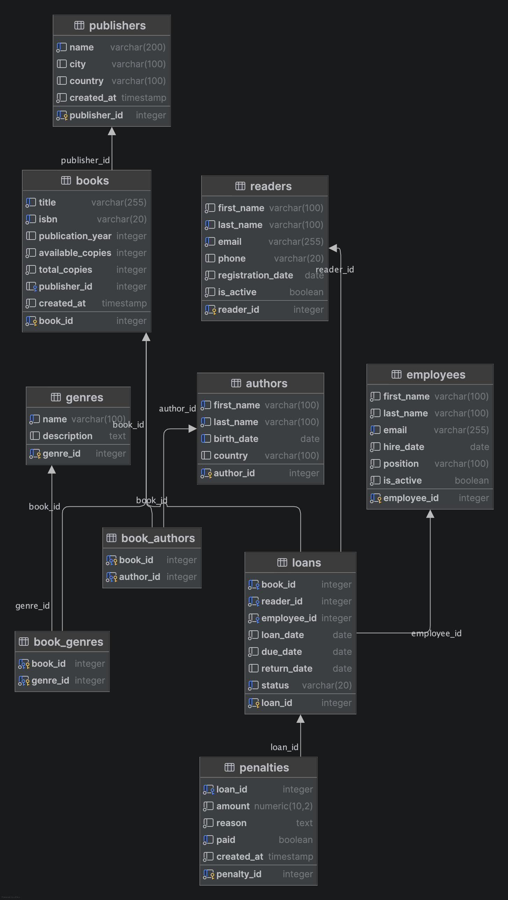

# System zarządzania biblioteką

Uniwersytet Merito Chorzów  
Data opracowania: 18.06.2026

Autor: Kacper Mila

## 1. Informacje ogólne

Dokumentacja opisuje projekt relacyjnej bazy danych dla systemu zarządzania biblioteką. Projekt został przygotowany w PostgreSQL 16 i uruchamiany jest lokalnie przy użyciu Docker Compose. Baza danych przechowuje informacje o książkach, autorach, gatunkach, wydawcach, czytelnikach, pracownikach, wypożyczeniach oraz karach za nieterminowy zwrot.

Repozytorium zawiera komplet skryptów SQL odpowiedzialnych za utworzenie bazy, tabel, danych testowych, zapytań przykładowych, procedur, funkcji, wyzwalaczy, ról i testów walidacyjnych.

## 2. Wstęp

### 2.1 Cel projektu

Celem projektu jest stworzenie systemu bazodanowego wspierającego podstawową obsługę biblioteki. System centralizuje dane dotyczące księgozbioru, użytkowników biblioteki i operacji wypożyczania, dzięki czemu umożliwia kontrolę dostępności książek, analizę historii wypożyczeń oraz naliczanie kar za opóźnienia.

Projekt rozwiązuje problem ręcznego prowadzenia ewidencji bibliotecznej, która jest podatna na błędy, trudna do przeszukiwania i niewygodna przy generowaniu zestawień. Relacyjna baza danych zapewnia spójność danych, kontrolę dostępu i możliwość automatyzacji najczęstszych operacji.

### 2.2 Zakres projektu

Zakres systemu obejmuje:

- zarządzanie książkami, ich numerami ISBN, rokiem publikacji oraz liczbą egzemplarzy,
- zarządzanie autorami i przypisywanie wielu autorów do jednej książki,
- zarządzanie gatunkami i przypisywanie wielu gatunków do jednej książki,
- przechowywanie danych wydawców,
- rejestrację czytelników i pracowników biblioteki,
- obsługę wypożyczeń i zwrotów,
- kontrolę statusu wypożyczenia: aktywne, zwrócone, opóźnione lub utracone,
- naliczanie kar za opóźniony zwrot,
- definiowanie ról użytkowników i uprawnień,
- wykonywanie zapytań raportowych i testów walidacyjnych.

### 2.3 Użyte technologie

| Technologia | Zastosowanie |
| --- | --- |
| SQL | Tworzenie struktur, danych testowych, zapytań i uprawnień |
| PostgreSQL 16 | System zarządzania relacyjną bazą danych |
| Docker Compose | Lokalne uruchomienie kontenera z bazą |
| DataGrip lub pgAdmin | Przykładowe narzędzia do pracy z bazą |

### 2.4 Motywacja

Biblioteka potrzebuje systemu, który pozwoli szybko sprawdzić dostępność książek, przypisać książki do autorów i gatunków, zarejestrować wypożyczenie oraz kontrolować terminy zwrotu. Automatyzacja procedur wypożyczania i zwrotu zmniejsza ryzyko błędów, np. wypożyczenia książki bez dostępnych egzemplarzy lub ręcznego pominięcia naliczenia kary za opóźnienie.

## 3. Analiza wymagań

### 3.1 Użytkownicy systemu

W projekcie przewidziano trzy główne role bazodanowe:

| Rola | Opis | Zakres odpowiedzialności |
| --- | --- | --- |
| `library_admin` | Administrator systemu | Pełne zarządzanie tabelami, sekwencjami i danymi w schemacie `library` |
| `library_librarian` | Bibliotekarz | Obsługa książek, autorów, gatunków, czytelników, wypożyczeń i kar |
| `library_reader` | Czytelnik | Odczyt podstawowych informacji katalogowych: książek, autorów, gatunków i wydawców |

Dodatkowo skrypt tworzy użytkowników testowych:

- `admin_user`,
- `librarian_user`,
- `reader_user`.

### 3.2 Funkcjonalności systemu

Najważniejsze funkcjonalności systemu:

- dodawanie i przechowywanie informacji o książkach,
- przypisywanie książek do wydawców,
- przypisywanie książek do wielu autorów,
- przypisywanie książek do wielu gatunków,
- rejestracja czytelników i pracowników,
- tworzenie wypożyczenia tylko wtedy, gdy książka jest dostępna,
- automatyczne zmniejszanie liczby dostępnych egzemplarzy przy wypożyczeniu,
- obsługa zwrotu książki,
- automatyczne zwiększanie liczby dostępnych egzemplarzy przy zwrocie,
- automatyczna zmiana statusu wypożyczenia na podstawie terminu zwrotu,
- automatyczne naliczanie kary za opóźniony zwrot,
- raportowanie aktywnych i opóźnionych wypożyczeń,
- wyszukiwanie książek według autorów, gatunków i historii wypożyczeń.

### 3.3 Wymagania niefunkcjonalne

| Wymaganie | Realizacja |
| --- | --- |
| Spójność danych | Klucze główne, klucze obce, ograniczenia `CHECK`, ograniczenia `UNIQUE` |
| Integralność relacji | Relacje z akcjami `ON UPDATE CASCADE`, `ON DELETE CASCADE`, `ON DELETE RESTRICT` i `ON DELETE SET NULL` |
| Bezpieczeństwo | Role i uprawnienia zdefiniowane w `sql/06_roles_permissions.sql` |
| Wydajność | Indeksy na kolumnach często używanych w wyszukiwaniu i połączeniach |
| Powtarzalność uruchomienia | Skrypty SQL podzielone według kolejności wykonania |
| Testowalność | Osobny skrypt `sql/07_tests.sql`, wykonywany w transakcji z `ROLLBACK` |

### 3.4 Uprawnienia użytkowników

Role i uprawnienia tworzy plik `sql/06_roles_permissions.sql`.

Fragment definicji ról:

```sql
DO $$
BEGIN
    IF NOT EXISTS (SELECT 1 FROM pg_roles WHERE rolname = 'library_admin') THEN
        CREATE ROLE library_admin;
    END IF;

    IF NOT EXISTS (SELECT 1 FROM pg_roles WHERE rolname = 'library_librarian') THEN
        CREATE ROLE library_librarian;
    END IF;

    IF NOT EXISTS (SELECT 1 FROM pg_roles WHERE rolname = 'library_reader') THEN
        CREATE ROLE library_reader;
    END IF;
END
$$;
```

Zakres uprawnień:

| Rola | Uprawnienia |
| --- | --- |
| `library_admin` | `SELECT`, `INSERT`, `UPDATE`, `DELETE` na wszystkich tabelach oraz obsługa sekwencji |
| `library_librarian` | Odczyt, dodawanie i aktualizacja danych operacyjnych biblioteki |
| `library_reader` | Odczyt katalogu książek, autorów, gatunków i wydawców |

## 4. Model bazy danych

### 4.1 Diagram ERD

Diagram relacji znajduje się w pliku:



### 4.2 Schemat logiczny

Baza korzysta ze schematu `library`. W schemacie zdefiniowano 10 tabel:

- `publishers`,
- `genres`,
- `authors`,
- `books`,
- `book_authors`,
- `book_genres`,
- `readers`,
- `employees`,
- `loans`,
- `penalties`.

### 4.3 Opis tabel

| Tabela | Opis | Najważniejsze kolumny |
| --- | --- | --- |
| `publishers` | Dane wydawców | `publisher_id` (PK), `name`, `city`, `country`, `created_at` |
| `genres` | Słownik gatunków literackich | `genre_id` (PK), `name`, `description` |
| `authors` | Dane autorów | `author_id` (PK), `first_name`, `last_name`, `birth_date`, `country` |
| `books` | Dane książek i liczba egzemplarzy | `book_id` (PK), `title`, `isbn`, `publication_year`, `available_copies`, `total_copies`, `publisher_id` (FK) |
| `book_authors` | Tabela łącząca książki i autorów | `book_id` (PK, FK), `author_id` (PK, FK) |
| `book_genres` | Tabela łącząca książki i gatunki | `book_id` (PK, FK), `genre_id` (PK, FK) |
| `readers` | Dane czytelników | `reader_id` (PK), `first_name`, `last_name`, `email`, `phone`, `registration_date`, `is_active` |
| `employees` | Dane pracowników biblioteki | `employee_id` (PK), `first_name`, `last_name`, `email`, `hire_date`, `position`, `is_active` |
| `loans` | Rejestr wypożyczeń | `loan_id` (PK), `book_id` (FK), `reader_id` (FK), `employee_id` (FK), `loan_date`, `due_date`, `return_date`, `status` |
| `penalties` | Kary za opóźnienia | `penalty_id` (PK), `loan_id` (FK, UNIQUE), `amount`, `reason`, `paid`, `created_at` |

### 4.4 Relacje

| Relacja | Typ | Opis |
| --- | --- | --- |
| `publishers` -> `books` | 1:N | Jeden wydawca może mieć wiele książek |
| `books` -> `book_authors` -> `authors` | N:M | Jedna książka może mieć wielu autorów, a jeden autor wiele książek |
| `books` -> `book_genres` -> `genres` | N:M | Jedna książka może mieć wiele gatunków, a jeden gatunek wiele książek |
| `books` -> `loans` | 1:N | Jedna książka może wystąpić w wielu wypożyczeniach |
| `readers` -> `loans` | 1:N | Jeden czytelnik może mieć wiele wypożyczeń |
| `employees` -> `loans` | 1:N | Jeden pracownik może obsługiwać wiele wypożyczeń |
| `loans` -> `penalties` | 1:0..1 | Jedno wypożyczenie może mieć maksymalnie jedną karę |

### 4.5 Ograniczenia integralności

Najważniejsze ograniczenia:

- `isbn` w tabeli `books` jest unikalny,
- `email` w tabelach `readers` i `employees` jest unikalny,
- liczba dostępnych egzemplarzy nie może być mniejsza od zera,
- liczba wszystkich egzemplarzy musi być większa od zera,
- liczba dostępnych egzemplarzy nie może przekroczyć liczby wszystkich egzemplarzy,
- `due_date` nie może być wcześniejszy niż `loan_date`,
- `return_date` nie może być wcześniejszy niż `loan_date`,
- `status` wypożyczenia może przyjmować tylko wartości: `active`, `returned`, `overdue`, `lost`,
- dla jednego wypożyczenia można utworzyć tylko jedną karę.

## 5. Implementacja

### 5.1 Struktura plików SQL

| Plik | Przeznaczenie |
| --- | --- |
| `sql/01_create_database.sql` | Utworzenie roli właściciela i bazy `library_system` |
| `sql/02_create_tables.sql` | Utworzenie schematu, tabel, relacji, ograniczeń i indeksów |
| `sql/03_insert_test_data.sql` | Wstawienie danych testowych |
| `sql/04_queries.sql` | Przykładowe zapytania raportowe |
| `sql/05_procedures_functions_triggers.sql` | Funkcje, procedury i wyzwalacze |
| `sql/06_roles_permissions.sql` | Role użytkowników i uprawnienia |
| `sql/07_tests.sql` | Testy walidujące działanie procedur, funkcji i wyzwalaczy |

### 5.2 Uruchomienie środowiska

Plik `docker-compose.yaml` uruchamia kontener z PostgreSQL 16:

```yaml
services:
  postgres:
    image: postgres:16
    container_name: library-postgres
    restart: unless-stopped
    env_file:
      - .env
    ports:
      - "5432:5432"
```

Przykładowy plik `.env`:

```env
POSTGRES_USER=admin
POSTGRES_PASSWORD=admin123
POSTGRES_DB=library_db
```

Zmienna `POSTGRES_DB` tworzy startową bazę w kontenerze. Właściwa baza projektu, zgodnie ze skryptem `sql/01_create_database.sql`, nosi nazwę `library_system`.

Uruchomienie kontenera:

```bash
docker compose up -d
```

### 5.3 Kolejność wykonania skryptów

Zalecana kolejność uruchomienia:

```text
01_create_database.sql
02_create_tables.sql
03_insert_test_data.sql
05_procedures_functions_triggers.sql
06_roles_permissions.sql
04_queries.sql
07_tests.sql
```

Plik `01_create_database.sql` należy wykonać z poziomu domyślnej bazy `postgres`, ponieważ tworzy nową bazę `library_system`. Pozostałe pliki powinny być wykonywane po połączeniu z bazą `library_system`.

### 5.4 Tworzenie bazy danych

Plik `sql/01_create_database.sql` usuwa istniejącą bazę i rolę testową, a następnie tworzy nowego właściciela i bazę:

```sql
DROP DATABASE IF EXISTS library_system;
DROP ROLE IF EXISTS library_admin_user;

CREATE ROLE library_admin_user
    WITH LOGIN
    PASSWORD 'LibraryAdmin123!';

CREATE DATABASE library_system
    OWNER library_admin_user
    ENCODING 'UTF8';
```

### 5.5 Tworzenie tabel

Tabele tworzone są w schemacie `library`. Przykładowa definicja tabeli `books`:

```sql
CREATE TABLE library.books (
    book_id           SERIAL PRIMARY KEY,
    title             VARCHAR(255) NOT NULL,
    isbn              VARCHAR(20) NOT NULL UNIQUE,
    publication_year  INTEGER CHECK (publication_year IS NULL OR publication_year > 0),
    available_copies  INTEGER NOT NULL DEFAULT 0 CHECK (available_copies >= 0),
    total_copies      INTEGER NOT NULL DEFAULT 1 CHECK (total_copies > 0),
    publisher_id      INTEGER REFERENCES library.publishers(publisher_id) ON UPDATE CASCADE ON DELETE SET NULL,
    created_at        TIMESTAMP NOT NULL DEFAULT CURRENT_TIMESTAMP,
    CONSTRAINT chk_books_available_not_greater_than_total CHECK (available_copies <= total_copies)
);
```

Przykładowa definicja tabeli `loans`:

```sql
CREATE TABLE library.loans (
    loan_id           SERIAL PRIMARY KEY,
    book_id           INTEGER NOT NULL REFERENCES library.books(book_id) ON UPDATE CASCADE ON DELETE RESTRICT,
    reader_id         INTEGER NOT NULL REFERENCES library.readers(reader_id) ON UPDATE CASCADE ON DELETE RESTRICT,
    employee_id       INTEGER NOT NULL REFERENCES library.employees(employee_id) ON UPDATE CASCADE ON DELETE RESTRICT,
    loan_date         DATE NOT NULL DEFAULT CURRENT_DATE,
    due_date          DATE NOT NULL,
    return_date       DATE,
    status            VARCHAR(20) NOT NULL DEFAULT 'active',
    CONSTRAINT chk_loans_due_date CHECK (due_date >= loan_date),
    CONSTRAINT chk_loans_return_date CHECK (return_date IS NULL OR return_date >= loan_date),
    CONSTRAINT chk_loans_status CHECK (status IN ('active', 'returned', 'overdue', 'lost'))
);
```

### 5.6 Dane testowe

Plik `sql/03_insert_test_data.sql` wstawia przykładowe dane:

- 4 wydawców,
- 5 gatunków,
- 5 autorów,
- 5 książek,
- powiązania książek z autorami i gatunkami,
- 4 czytelników,
- 3 pracowników,
- 4 wypożyczenia,
- 1 karę.

Przykładowe książki w danych testowych:

| Tytuł | ISBN | Rok publikacji | Dostępne egzemplarze | Wszystkie egzemplarze |
| --- | --- | --- | --- | --- |
| `1984` | `9780451524935` | 1949 | 3 | 5 |
| `Dune` | `9780441172719` | 1965 | 2 | 4 |
| `Ice` | `9788308041828` | 2007 | 1 | 2 |
| `Clean Code` | `9780132350884` | 2008 | 4 | 4 |
| `Sapiens` | `9780062316097` | 2011 | 0 | 3 |

## 6. Procedury, funkcje i wyzwalacze

Obiekty proceduralne zdefiniowano w pliku `sql/05_procedures_functions_triggers.sql`.

### 6.1 Funkcja `library.is_book_available`

Funkcja sprawdza, czy książka ma co najmniej jeden dostępny egzemplarz. Jeśli książka o podanym identyfikatorze nie istnieje, zgłaszany jest wyjątek.

```sql
CREATE OR REPLACE FUNCTION library.is_book_available(p_book_id INTEGER)
RETURNS BOOLEAN
LANGUAGE plpgsql
AS $$
DECLARE
    v_available_copies INTEGER;
BEGIN
    SELECT b.available_copies
    INTO v_available_copies
    FROM library.books b
    WHERE b.book_id = p_book_id;

    IF v_available_copies IS NULL THEN
        RAISE EXCEPTION 'Book with id % does not exist.', p_book_id;
    END IF;

    RETURN v_available_copies > 0;
END;
$$;
```

### 6.2 Procedura `library.create_loan`

Procedura tworzy nowe wypożyczenie i zmniejsza liczbę dostępnych egzemplarzy książki. Przed utworzeniem wypożyczenia sprawdza dostępność książki.

```sql
CREATE OR REPLACE PROCEDURE library.create_loan(
    p_book_id INTEGER,
    p_reader_id INTEGER,
    p_employee_id INTEGER,
    p_due_date DATE
)
LANGUAGE plpgsql
AS $$
BEGIN
    IF NOT library.is_book_available(p_book_id) THEN
        RAISE EXCEPTION 'Book with id % is not available.', p_book_id;
    END IF;

    INSERT INTO library.loans (book_id, reader_id, employee_id, loan_date, due_date, status)
    VALUES (p_book_id, p_reader_id, p_employee_id, CURRENT_DATE, p_due_date, 'active');

    UPDATE library.books
    SET available_copies = available_copies - 1
    WHERE book_id = p_book_id;
END;
$$;
```

### 6.3 Procedura `library.return_book`

Procedura obsługuje zwrot książki. Ustawia datę zwrotu, zmienia status wypożyczenia na `returned` i zwiększa liczbę dostępnych egzemplarzy.

```sql
CREATE OR REPLACE PROCEDURE library.return_book(
    p_loan_id INTEGER
)
LANGUAGE plpgsql
AS $$
DECLARE
    v_book_id INTEGER;
    v_status VARCHAR(20);
BEGIN
    SELECT l.book_id, l.status
    INTO v_book_id, v_status
    FROM library.loans l
    WHERE l.loan_id = p_loan_id;

    IF v_book_id IS NULL THEN
        RAISE EXCEPTION 'Loan with id % does not exist.', p_loan_id;
    END IF;

    IF v_status = 'returned' THEN
        RAISE EXCEPTION 'Loan with id % has already been returned.', p_loan_id;
    END IF;

    UPDATE library.loans
    SET return_date = CURRENT_DATE,
        status = 'returned'
    WHERE loan_id = p_loan_id;

    UPDATE library.books
    SET available_copies = available_copies + 1
    WHERE book_id = v_book_id;
END;
$$;
```

### 6.4 Funkcja `library.count_reader_overdue_loans`

Funkcja zwraca liczbę opóźnionych, niezwróconych wypożyczeń wybranego czytelnika.

```sql
CREATE OR REPLACE FUNCTION library.count_reader_overdue_loans(p_reader_id INTEGER)
RETURNS INTEGER
LANGUAGE sql
AS $$
    SELECT COUNT(*)::INTEGER
    FROM library.loans
    WHERE reader_id = p_reader_id
      AND return_date IS NULL
      AND due_date < CURRENT_DATE;
$$;
```

### 6.5 Wyzwalacz `trg_set_loan_status_before_write`

Wyzwalacz automatycznie ustawia status wypożyczenia przed zapisem:

- `returned`, jeśli podano datę zwrotu,
- `overdue`, jeśli termin zwrotu minął,
- `active`, jeśli wypożyczenie nadal jest aktualne.

```sql
CREATE TRIGGER trg_set_loan_status_before_write
BEFORE INSERT OR UPDATE ON library.loans
FOR EACH ROW
EXECUTE FUNCTION library.set_loan_status_before_write();
```

### 6.6 Wyzwalacz `trg_create_penalty_after_late_return`

Wyzwalacz tworzy karę po aktualizacji daty zwrotu, jeżeli książka została zwrócona po terminie. Wysokość kary wynosi `2.50` za każdy dzień opóźnienia.

```sql
CREATE TRIGGER trg_create_penalty_after_late_return
AFTER UPDATE OF return_date ON library.loans
FOR EACH ROW
EXECUTE FUNCTION library.create_penalty_after_late_return();
```

## 7. Przykładowe zapytania SQL

Przykładowe zapytania znajdują się w pliku `sql/04_queries.sql`. Obejmują proste i złożone instrukcje `SELECT`, filtrowanie, aliasy, agregacje, grupowanie, podzapytania oraz operacje zbiorowe.

### 7.1 Lista książek wybranego autora

```sql
SELECT
    b.book_id,
    b.title,
    b.isbn,
    b.publication_year,
    a.first_name || ' ' || a.last_name AS author
FROM library.books b
JOIN library.book_authors ba ON ba.book_id = b.book_id
JOIN library.authors a ON a.author_id = ba.author_id
WHERE a.last_name = 'Orwell'
ORDER BY b.title;
```

### 7.2 Czytelnicy, którzy wypożyczyli książki z wybranego gatunku

```sql
SELECT DISTINCT
    r.reader_id,
    r.first_name,
    r.last_name,
    r.email,
    g.name AS genre
FROM library.readers r
JOIN library.loans l ON l.reader_id = r.reader_id
JOIN library.books b ON b.book_id = l.book_id
JOIN library.book_genres bg ON bg.book_id = b.book_id
JOIN library.genres g ON g.genre_id = bg.genre_id
WHERE g.name = 'Science Fiction'
ORDER BY r.last_name;
```

### 7.3 Liczba wypożyczeń z ostatniego miesiąca

Zapytanie wykorzystuje funkcję agregującą `COUNT` i filtr `WHERE` ograniczający wynik do wypożyczeń z ostatniego miesiąca.

```sql
SELECT
    COUNT(*) AS loans_last_month
FROM library.loans
WHERE loan_date >= CURRENT_DATE - INTERVAL '1 month';
```

### 7.4 Aktywne opóźnione wypożyczenia

```sql
SELECT
    l.loan_id,
    b.title,
    r.first_name || ' ' || r.last_name AS reader,
    l.loan_date,
    l.due_date,
    CURRENT_DATE - l.due_date AS days_overdue
FROM library.loans l
JOIN library.books b ON b.book_id = l.book_id
JOIN library.readers r ON r.reader_id = l.reader_id
WHERE l.return_date IS NULL
  AND l.due_date < CURRENT_DATE
ORDER BY days_overdue DESC;
```

### 7.5 Liczba wypożyczeń per czytelnik

Zapytanie pokazuje logiczne przetwarzanie danych z użyciem `FROM`, aliasów tabel, `GROUP BY`, `HAVING`, aliasu kolumny wynikowej i sortowania po liczbie wypożyczeń.

```sql
SELECT
    r.reader_id,
    r.first_name,
    r.last_name,
    COUNT(l.loan_id) AS loan_count
FROM library.readers r
LEFT JOIN library.loans l ON l.reader_id = r.reader_id
GROUP BY r.reader_id, r.first_name, r.last_name
HAVING COUNT(l.loan_id) >= 1
ORDER BY loan_count DESC, r.last_name;
```

### 7.6 Książki, które nigdy nie były wypożyczone

Jest to przykład podzapytania zagnieżdżonego z `NOT EXISTS`.

```sql
SELECT
    b.book_id,
    b.title,
    b.isbn
FROM library.books b
WHERE NOT EXISTS (
    SELECT 1
    FROM library.loans l
    WHERE l.book_id = b.book_id
)
ORDER BY b.title;
```

### 7.7 Czytelnicy z więcej niż jedną zaległością

Jest to przykład podzapytania skorelowanego. Podzapytanie odwołuje się do aktualnego czytelnika z zapytania zewnętrznego przez `l.reader_id = r.reader_id`.

```sql
SELECT
    r.reader_id,
    r.first_name,
    r.last_name
FROM library.readers r
WHERE (
    SELECT COUNT(*)
    FROM library.loans l
    WHERE l.reader_id = r.reader_id
      AND l.status IN ('active', 'overdue')
) > 1;
```

### 7.8 UNION: wspólna lista osób w systemie

```sql
SELECT first_name, last_name, email, 'reader' AS person_type
FROM library.readers
UNION
SELECT first_name, last_name, email, 'employee' AS person_type
FROM library.employees
ORDER BY last_name, first_name;
```

### 7.9 EXCEPT: książki, które nie są aktualnie wypożyczone

```sql
SELECT book_id, title
FROM library.books
EXCEPT
SELECT b.book_id, b.title
FROM library.books b
JOIN library.loans l ON l.book_id = b.book_id
WHERE l.status IN ('active', 'overdue')
ORDER BY title;
```

### 7.10 INTERSECT: czytelnicy, którzy wypożyczyli książki z dwóch gatunków

Zapytanie pokazuje część wspólną dwóch zbiorów czytelników. W przykładowych danych użyto gatunków `Novel` i `History`.

```sql
SELECT r.reader_id, r.first_name, r.last_name
FROM library.readers r
JOIN library.loans l ON l.reader_id = r.reader_id
JOIN library.book_genres bg ON bg.book_id = l.book_id
JOIN library.genres g ON g.genre_id = bg.genre_id
WHERE g.name = 'Novel'
INTERSECT
SELECT r.reader_id, r.first_name, r.last_name
FROM library.readers r
JOIN library.loans l ON l.reader_id = r.reader_id
JOIN library.book_genres bg ON bg.book_id = l.book_id
JOIN library.genres g ON g.genre_id = bg.genre_id
WHERE g.name = 'History';
```

### 7.11 Lista wypożyczonych książek per czytelnik

Zapytanie wykorzystuje agregację `STRING_AGG`, aliasy i sortowanie wyników.

```sql
SELECT
    r.reader_id,
    r.first_name,
    r.last_name,
    COUNT(l.loan_id) AS borrow_count,
    COALESCE(
      STRING_AGG(DISTINCT b.title, ', ' ORDER BY b.title),
      '') AS books_ever_borrowed
FROM library.readers r
LEFT JOIN library.loans l ON l.reader_id = r.reader_id
LEFT JOIN library.books b ON b.book_id = l.book_id
GROUP BY r.reader_id, r.first_name, r.last_name
ORDER BY r.last_name, r.first_name;
```

### 7.12 Eksport danych do arkusza kalkulacyjnego

Dane można wyeksportować do formatu CSV, a następnie otworzyć w Excelu lub innym arkuszu kalkulacyjnym. Przykładowe zestawienie wypożyczeń:

```sql
SELECT
    r.first_name AS reader_first_name,
    r.last_name AS reader_last_name,
    b.title AS book_title,
    l.loan_date,
    l.due_date,
    l.return_date,
    l.status
FROM library.loans l
JOIN library.readers r ON r.reader_id = l.reader_id
JOIN library.books b ON b.book_id = l.book_id
ORDER BY r.last_name, l.loan_date;
```

W narzędziu `psql` eksport można wykonać poleceniem:

```sql
\copy (
    SELECT
        r.first_name AS reader_first_name,
        r.last_name AS reader_last_name,
        b.title AS book_title,
        l.loan_date,
        l.due_date,
        l.return_date,
        l.status
    FROM library.loans l
    JOIN library.readers r ON r.reader_id = l.reader_id
    JOIN library.books b ON b.book_id = l.book_id
    ORDER BY r.last_name, l.loan_date
) TO 'loans_export.csv' WITH CSV HEADER;
```

## 8. Operacje DML

Operacje DML obejmują dodawanie, aktualizowanie i usuwanie danych. W projekcie są wykorzystywane bezpośrednio w plikach z danymi testowymi, procedurach oraz testach walidacyjnych.

### 8.1 Dodanie nowej książki

Przykład dodaje nową książkę przypisaną do istniejącego wydawcy.

```sql
INSERT INTO library.books (
    title,
    isbn,
    publication_year,
    available_copies,
    total_copies,
    publisher_id
) VALUES (
    'The Pragmatic Programmer',
    '9780201616224',
    1999,
    2,
    2,
    4
);
```

### 8.2 Dodanie wypożyczenia

Wypożyczenie można dodać bezpośrednio instrukcją `INSERT`, jednak zalecanym sposobem jest użycie procedury `library.create_loan`, ponieważ sprawdza ona dostępność książki i aktualizuje liczbę egzemplarzy.

```sql
CALL library.create_loan(3, 2, 1, CURRENT_DATE + 14);
```

### 8.3 Aktualizacja informacji o zwrocie

Zwrot można obsłużyć procedurą `library.return_book`, która ustawia datę zwrotu, zmienia status wypożyczenia i zwiększa liczbę dostępnych egzemplarzy.

```sql
CALL library.return_book(2);
```

Odpowiada to logicznie aktualizacji danych w tabelach `loans` i `books`:

```sql
UPDATE library.loans
SET return_date = CURRENT_DATE,
    status = 'returned'
WHERE loan_id = 2;
```

### 8.4 Aktualizacja kary

Przykładowa aktualizacja oznacza karę jako opłaconą.

```sql
UPDATE library.penalties
SET paid = TRUE
WHERE penalty_id = 1;
```

### 8.5 Usuwanie nieaktywnych czytelników

Ze względu na klucze obce nie należy usuwać czytelników posiadających historię wypożyczeń. Bezpieczny wariant usuwa tylko nieaktywnych czytelników, dla których nie istnieją powiązane rekordy w tabeli `loans`.

```sql
DELETE FROM library.readers r
WHERE r.is_active = FALSE
  AND NOT EXISTS (
      SELECT 1
      FROM library.loans l
      WHERE l.reader_id = r.reader_id
  );
```

## 9. Indeksy i optymalizacja

W pliku `sql/02_create_tables.sql` utworzono indeksy wspierające wyszukiwanie i łączenie danych:

```sql
CREATE INDEX idx_books_title ON library.books(title);
CREATE INDEX idx_authors_last_name ON library.authors(last_name);
CREATE INDEX idx_readers_last_name ON library.readers(last_name);
CREATE INDEX idx_loans_reader_id ON library.loans(reader_id);
CREATE INDEX idx_loans_book_id ON library.loans(book_id);
CREATE INDEX idx_loans_status ON library.loans(status);
CREATE INDEX idx_penalties_paid ON library.penalties(paid);
```

Indeksy przyspieszają m.in.:

- wyszukiwanie książek po tytule,
- wyszukiwanie autorów i czytelników po nazwisku,
- filtrowanie wypożyczeń po statusie,
- łączenie tabel `loans`, `books` i `readers`,
- sprawdzanie opłaconych i nieopłaconych kar.

## 10. Testowanie i walidacja

Testy znajdują się w pliku `sql/07_tests.sql`. Skrypt wykonywany jest w transakcji zakończonej `ROLLBACK`, dzięki czemu można uruchamiać go wielokrotnie bez trwałej zmiany danych.

### 10.1 Test dostępności książki

```sql
SELECT library.is_book_available(1) AS is_book_1_available;
```

Oczekiwany wynik: funkcja zwraca `true`, jeżeli książka o identyfikatorze `1` ma dostępne egzemplarze.

### 10.2 Test utworzenia wypożyczenia

```sql
CALL library.create_loan(3, 2, 1, CURRENT_DATE + 14);
```

Oczekiwany wynik:

- powstaje nowe wypożyczenie,
- status zostaje ustawiony na `active`,
- liczba dostępnych egzemplarzy książki zostaje zmniejszona o 1.

### 10.3 Test zwrotu książki

```sql
CALL library.return_book(v_created_loan_id);
```

Oczekiwany wynik:

- wypożyczenie otrzymuje datę zwrotu,
- status zmienia się na `returned`,
- liczba dostępnych egzemplarzy książki zostaje zwiększona o 1.

### 10.4 Test liczby opóźnionych wypożyczeń

```sql
SELECT library.count_reader_overdue_loans(1) AS overdue_loans_for_reader_1;
```

Oczekiwany wynik: funkcja zwraca liczbę wypożyczeń czytelnika `1`, które nie zostały zwrócone i mają przekroczony termin zwrotu.

### 10.5 Test naliczania kary

Skrypt tworzy opóźnione wypożyczenie, a następnie wykonuje zwrot. Wyzwalacz powinien automatycznie utworzyć wpis w tabeli `penalties`.

Oczekiwany wynik:

- status wypożyczenia po zwrocie to `returned`,
- w tabeli `penalties` pojawia się kara,
- kwota kary jest wyliczona jako liczba dni opóźnienia pomnożona przez `2.50`,
- kara ma ustawione `paid = false`.

## 11. Bezpieczeństwo danych

Projekt wykorzystuje kilka poziomów zabezpieczeń:

- osobny schemat `library`,
- role bazodanowe dla administratora, bibliotekarza i czytelnika,
- ograniczenie dostępu czytelnika tylko do danych katalogowych,
- ograniczenia `CHECK` zabezpieczające przed nieprawidłowymi wartościami,
- klucze obce pilnujące spójności relacji,
- unikalność pól takich jak ISBN i e-mail,
- transakcyjny skrypt testowy zakończony `ROLLBACK`.

## 12. Wnioski

### 12.1 Co działa dobrze

Projekt spełnia podstawowe wymagania systemu bibliotecznego. Struktura bazy jest czytelna i rozdziela dane słownikowe, katalogowe oraz operacyjne. Relacje wiele-do-wielu dla autorów i gatunków pozwalają realistycznie modelować książki. Procedury i wyzwalacze automatyzują najważniejsze operacje, czyli wypożyczenie, zwrot, zmianę statusu oraz naliczenie kary.

Dużą zaletą projektu jest podział na osobne skrypty SQL. Ułatwia to uruchamianie bazy etapami, testowanie poszczególnych części oraz ocenę projektu.

### 12.2 Co można poprawić

Projekt można rozbudować o:

- tabelę rezerwacji książek,
- historię zmian liczby egzemplarzy,
- rozbudowaną walidację numerów telefonu i adresów e-mail,
- widoki raportowe dla administratora i bibliotekarza,
- logowanie zmian w tabelach operacyjnych,
- automatyczne aktualizowanie statusu `overdue` dla istniejących aktywnych wypożyczeń w zadaniu cyklicznym,
- interfejs aplikacyjny, np. panel webowy dla bibliotekarza i katalog dla czytelnika.

### 12.3 Możliwe kierunki rozwoju

W kolejnych etapach system można rozszerzyć o aplikację frontendową lub API. Dzięki temu bibliotekarze mogliby obsługiwać wypożyczenia przez formularze, a czytelnicy mogliby samodzielnie sprawdzać dostępność książek, historię wypożyczeń i naliczone kary.

Można również dodać moduł powiadomień, który przypominałby czytelnikom o zbliżającym się terminie zwrotu albo informował o naliczonej karze.
